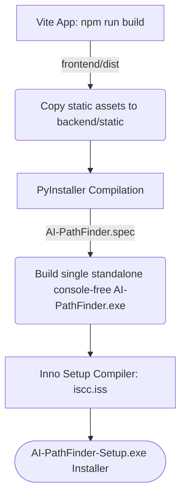

# <p align="center">🚀 AI-PathFinder</p>

<p align="center">
  <strong>Your Personal AI-Powered Career & Learning Co-Pilot</strong>
</p>

<p align="center">
  
  
  
  
  
  
</p>

<p align="center">
  
  
  
  
</p>

---

## 📁 Repository Details
* **Repository Name**: `AI-PathFinder`
* **Repository URL**: [https://github.com/karansinghverma979/AI-PathFinder](https://github.com/karansinghverma979/AI-PathFinder)
* **SSH Clone Path**: `git@github.com:karansinghverma979/AI-PathFinder.git`
* **Local Project Directory**: `C:\Users\karan\Void\AI PathFinder\F10_Popups_Karan_WebApp`

---

## 📷 Interactive Showcase (Tab Breakdown)

Here is a visual walk-through of each session within the application. Drag-and-drop your screenshots in the placeholder links below to customize this documentation.

### 🎯 1. Career Tab (Job Matcher)
* **Description**: Enter your core technical skills (comma-separated). The engine runs a search matching your profile to current corporate database vacancies, calculating match metrics based on title relevance, exact matches, and partial skill matches.
* **API Endpoints**: `POST /match_jobs`
* **UI Showcase Placeholder**:
  
  *(Replace with screenshot of career skills lookup and matching scores)*

---

### 📚 2. Learning Tab (AI Learning Forge)
* **Description**: Type in any career role (e.g. Frontend Developer, Machine Learning Engineer) to forge a custom structured learning path. Provides visual steps graded by difficulty (Easy, Medium, Hard) and connects to online video guides, tutorials, and Github projects.
* **API Endpoints**: `POST /learning`
* **UI Showcase Placeholder**:
  
  *(Replace with screenshot of step-by-step visual learning roadmap)*

---

### 💼 3. Hiring Tab (Recruitment Hub)
* **Description**: Intended for companies. Enter a job description (e.g., "Need a Python developer skilled in Django and APIs"), and the app runs a scan of the local candidate base, ranking applicants by skill alignment and providing one-click composition windows to contact candidates.
* **API Endpoints**: `POST /hiring`
* **UI Showcase Placeholder**:
  
  *(Replace with screenshot of companies scanning and selecting top candidates)*

---

### 👥 4. Candidates Tab (Profile Manager)
* **Description**: CRUD panel to view, add, edit, or delete candidates from the global candidate registry database. Features random avatar style selectors (via Dicebear API) for profiles. Developer profiles are locked and protected from edits.
* **API Endpoints**: `GET /candidates`, `POST /candidates`, `PUT /candidates/{id}`, `DELETE /candidates/{id}`
* **UI Showcase Placeholder**:
  
  *(Replace with screenshot of candidates list grid and edit modals)*

---

### 🔍 5. Jobs Tab (Openings Manager)
* **Description**: System panel to manage active job openings in the database. Add new vacancies, configure required stacks, and link salaries.
* **API Endpoints**: `GET /jobs`, `POST /jobs`, `GET /jobs/{id}`, `GET /jobs/title/{title}`
* **UI Showcase Placeholder**:
  
  *(Replace with screenshot of open job registry and creation tools)*

---

### 🏢 6. Companies Tab (Directory Registry)
* **Description**: Management screen displaying registered companies offering vacancies. Links companies to their specific listings and email addresses.
* **API Endpoints**: `GET /companies`
* **UI Showcase Placeholder**:
  
  *(Replace with screenshot of company profile directories)*

---

### ℹ️ 7. About Tab (Architect Chronicles)
* **Description**: Generates developer profile cards for lead designers. Employs fluid spring animations, customizable tech stacks, visual link nodes, and coffee supportupi configurations. It utilizes the unified glassmorphism theme background.
* **API Endpoints**: `GET /candidates` (filtered by developer role)
* **UI Showcase Placeholder**:
  
  *(Replace with screenshot of developer biographies and profile cards)*

---

## 🛠️ Tech Stack & Color Palette

### 🎨 Visual Theme System
* **Global Background**: Smooth linear gradient from Dark Slate Slate (`rgb(15, 23, 42)`) to Deep Indigo (`rgb(49, 46, 129)`) overlaid with a fixed micro-dot grid pattern (`radial-gradient(rgba(229, 231, 235, 0.04) 1px, transparent 1px)`).
* **Glassmorphism Panels**: `rgba(255, 255, 255, 0.05)` translucent cards bordered with white opacity lines and active purple/pink shadows.
* **Fluid Animations**: Smooth page entries, tab changes, and spring hover scales powered by **Framer Motion**.

### 💻 Technologies Utilized
* **Frontend Core**: React 19, Tailwind CSS 4, React Icons (Feather-Icons)
* **Build Wrapper**: Vite
* **Backend Framework**: FastAPI (Uvicorn HTTP server thread)
* **Storage Database**: SQLite3 (Dynamic connection routing)
* **GUI Desktop Window**: PyWebView (Chromeless native Edge WebView2 container wrapper)

---

## 📦 Bundling & Compilation Flow

For the production build release, follow this sequence:



### 1. Build Frontend Assets
```bash
cd frontend
npm run build
```
### 2. Copy Static Dist to Backend
```bash
cd ..
python -c "import shutil, os; shutil.rmtree('backend/static', ignore_errors=True); shutil.copytree('frontend/dist', 'backend/static')"
```
### 3. PyInstaller Standalone Compilation
Using PyInstaller in the backend virtual env with `--noconsole` to hide command prompt wrappers and `--icon` to embed the application branding:
```bash
cd backend
pip install pyinstaller Pillow pywebview
pyinstaller --onefile --noconsole --name "AI-PathFinder" --icon "icon.ico" --add-data "static;static" main.py
```
*Outputs compiled binary to: `backend/dist/AI-PathFinder.exe`*

### 4. Compile Installer (Inno Setup)
Runs `iscc.exe` from the workspace root:
```bash
iscc installer.iss
```
*Outputs setup file to: `C:\Users\karan\Void\AI PathFinder\F10_Popups_Karan_WebApp\AI-PathFinder-Setup.exe`*

---

## 🧹 Setup & Uninstaller Details

* **Interactive Setup Wizard**: Allows the user to select the program install path and prompts for a separate database destination folder. Saves settings into `config.json` inside the installation folder `{app}`.
* **Runtime Database Configuration**: On startup, [database.py](file:///C:/Users/karan/Void/AI%20PathFinder/F10_Popups_Karan_WebApp/backend/database.py) parses `config.json` to load the DB path. If the SQLite database does not exist, it runs the tables schema and auto-seeds jobs/companies/candidates immediately.
* **Deep Clean Uninstaller**: During uninstallation, the custom Pascal routine reads the DB target folder, deletes the database files (`candidates.db`, journal, WAL), removes parent data folders, and deletes `{app}` along with shortcut registrations.

---

## 🤝 The Architects
* **Karan Singh Verma** - *Lead Full Stack Developer*
* **Ankit Kushwaha** - *Backend Architect*
* **Akarshan Gupta** - *UI/UX Designer*

*AI-PathFinder © 2025*
