# 🧭 AI-PathFinder

> **AI-Powered Career Navigator, Skill Gap Visualizer & Autonomous Recruitment Matrix**

<p align="center">
  <a href="https://github.com/karansinghverma979/AI-PathFinder">
    
  </a>
</p>

<p align="center">
  
</p>

<p align="center">
  <a href="https://github.com/karansinghverma979/AI-PathFinder/releases/tag/v1.0.0">
    
  </a>
  
  <a href="CONTRIBUTING.md">
    
  </a>
  
  
  
  <a href="LICENSE">
    
  </a>
</p>

<p align="center">
  <a href="docs/ARCHITECTURE.md"><b>🏛️ Architecture Blueprint</b></a> ·
  <a href="docs/USER_GUIDE.md"><b>📖 User Manual</b></a> ·
  <a href="docs/INSTALLATION.md"><b>🚀 Installation Guide</b></a> ·
  <a href="RELEASE.md"><b>📦 Release Chronicles</b></a>
</p>

---

> [!NOTE]
> **🏛️ FLAGSHIP SHOWCASE & REPOSITORY STATUS**:
> **AI-PathFinder v1.0.0 is an immutable, feature-complete production showcase & architectural reference.** Active feature development has concluded, and external pull requests are not accepted. The project remains permanently open-source as an authoritative blueprint for self-contained, zero-dependency desktop applications uniting FastAPI and modern React with Inno Setup Windows deployment. All releases and standalone installers are permanently archived and immediately downloadable below. Developers are warmly invited to fork and customize the codebase under the [MIT License](LICENSE). See [CONTRIBUTING.md](CONTRIBUTING.md) for details.

---

<div align="center">

### 🚀 GET AI-PATHFINDER (STANDALONE INSTALLER)

[-009688?style=for-the-badge&logo=windows&logoColor=white)](https://github.com/karansinghverma979/AI-PathFinder/releases/download/v1.0.0/AI-PathFinder-Setup.exe)
[](https://github.com/karansinghverma979/AI-PathFinder/releases/tag/v1.0.0)

**1-Line PowerShell Auto-Download & Install:**
```powershell
irm https://github.com/karansinghverma979/AI-PathFinder/releases/download/v1.0.0/AI-PathFinder-Setup.exe -OutFile AI-PathFinder-Setup.exe; .\AI-PathFinder-Setup.exe
```

</div>

---

## ⚡ 5-Second System Architecture Card

```text
┌────────────────────────────────────────────────────────────────────────┐
│                   AI-PATHFINDER CO-PILOT ARCHITECTURE                  │
├───────────────────┬───────────────────┬────────────────────────────────┤
│    CAREER HUB     │   LEARNING FORGE  │          HIRING MATRIX         │
│  • Gap Analysis   │  • 3-Tier Paths   │  • Reverse Candidate Matcher   │
│  • Score Matching │  • React 19 / Py  │  • SQLite Talent Directory     │
│  • Missing Skills │  • Curated Guides │  • 1-Click Profile Outreach    │
├───────────────────┴───────────────────┴────────────────────────────────┤
│             STANDALONE INNO SETUP DESKTOP RUNTIME (WINDOWS)            │
│  FastAPI Backend (PyInstaller)  ◄──►  React 18 + Vite + Tailwind GUI   │
│  Custom DB Directory Wizard     ◄──►  Local SQLite (%LOCALAPPDATA%)    │
└────────────────────────────────────────────────────────────────────────┘
```

---

## 🚀 30-Second Quickstart

### Option A: Standalone Windows App (Recommended)
Download and run the pre-compiled installer. Zero external dependencies required (no Python or Node.js needed):
```powershell
irm https://github.com/karansinghverma979/AI-PathFinder/releases/download/v1.0.0/AI-PathFinder-Setup.exe -OutFile AI-PathFinder-Setup.exe; .\AI-PathFinder-Setup.exe
```

### Option B: Local Development from Source
For developers who want to inspect or extend the code:

1. **Clone the repository**:
   ```bash
   git clone https://github.com/karansinghverma979/AI-PathFinder.git
   cd AI-PathFinder
   ```

2. **Launch Backend (FastAPI)**:
   ```bash
   cd backend
   pip install -r requirements.txt
   python main.py
   ```
   *FastAPI server initializes on `http://127.0.0.1:8000` with automated SQLite schema generation and seeding.*

3. **Launch Frontend (Vite + React)**:
   ```bash
   cd ../frontend
   npm ci
   npm run dev
   ```
   *Interactive dashboard opens on `http://localhost:5173`.*

---

## 📷 Interactive Showcase (Tab Breakdown)

### 🎯 1. Career Tab (Job Matcher)
* **Description**: Enter your core technical skills (comma-separated). The engine scans corporate vacancies, calculating match metrics based on title relevance, exact skill intersections, and missing skill delta analysis.
* **API Endpoints**: `POST /match_jobs`

<p align="center">
  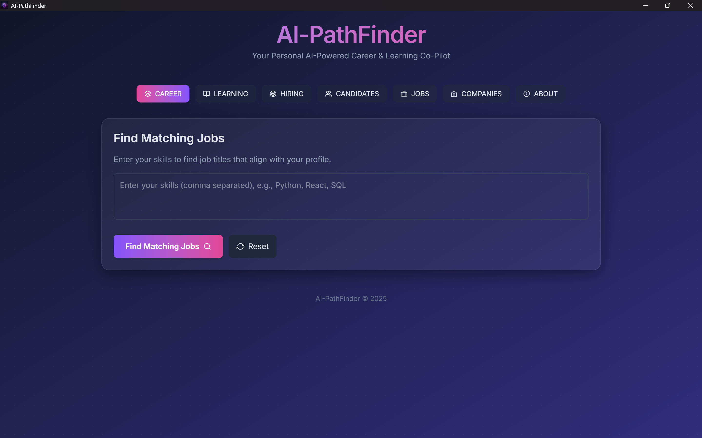
</p>

<p align="center">
  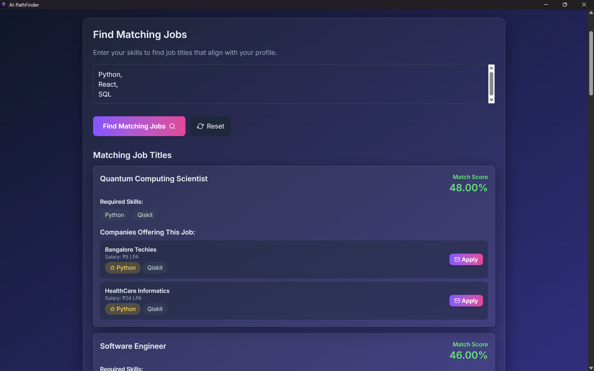
</p>

<p align="center">
  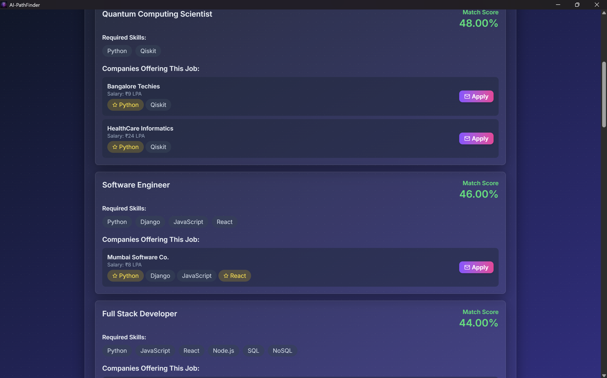
</p>

<p align="center">
  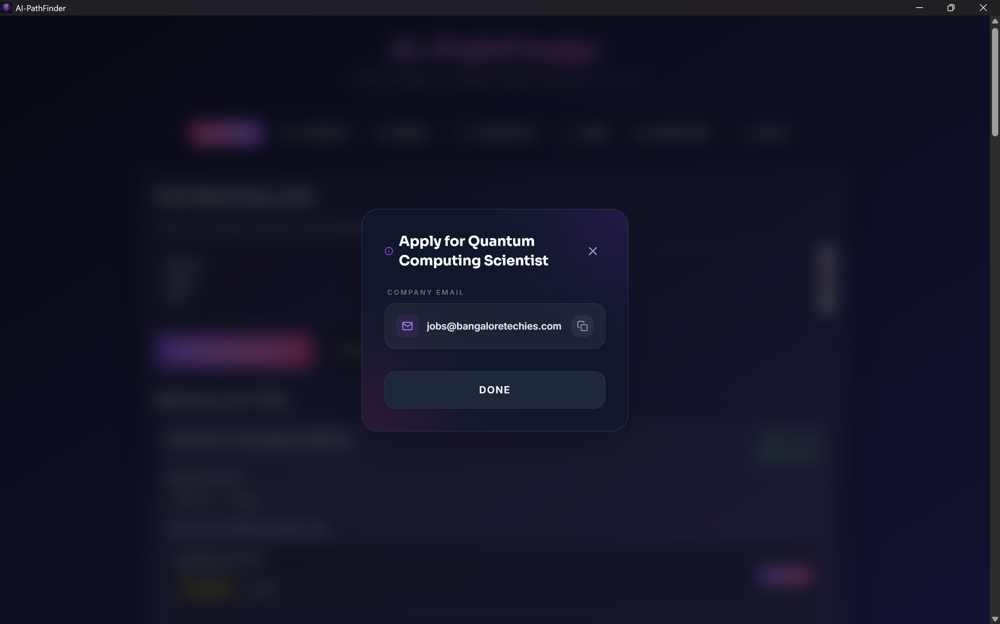
</p>

---

### 📚 2. Learning Tab (AI Learning Forge)
* **Description**: Enter any career role (e.g. *Frontend Developer*, *Machine Learning Engineer*) to synthesize a custom structured learning path. Generates visual roadmap milestones graded by difficulty (*Easy*, *Medium*, *Hard*) with direct links to video guides, official docs, and GitHub repositories.
* **API Endpoints**: `POST /learning`

<p align="center">
  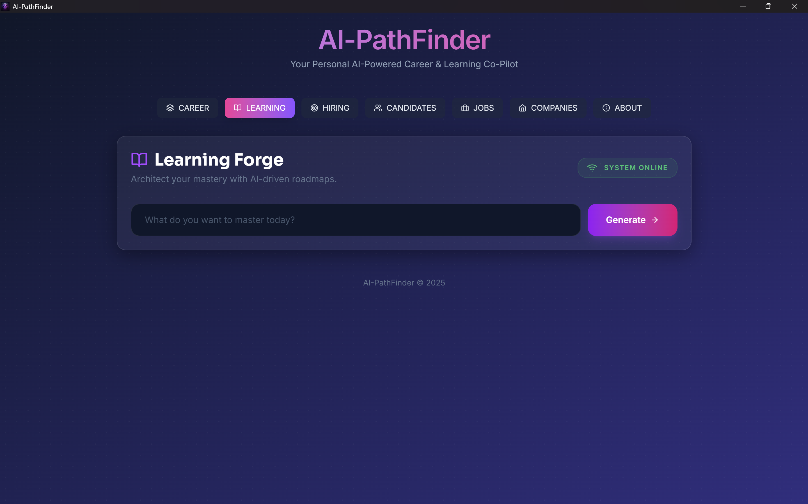
</p>

<p align="center">
  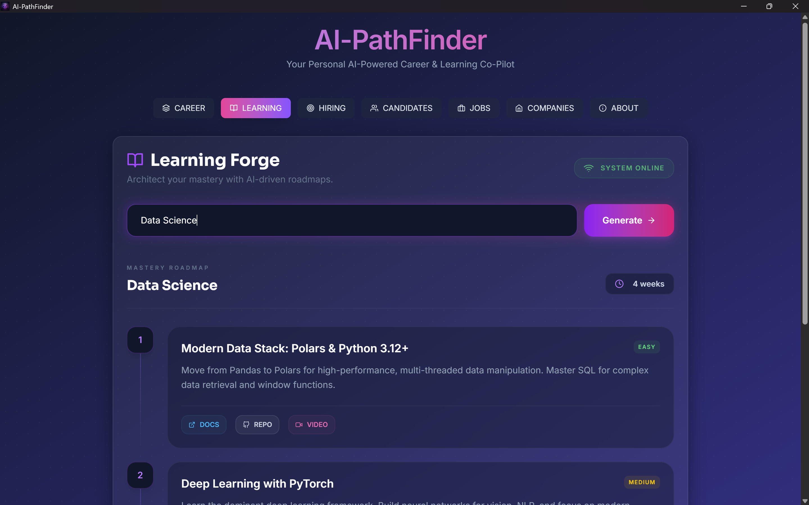
</p>

<p align="center">
  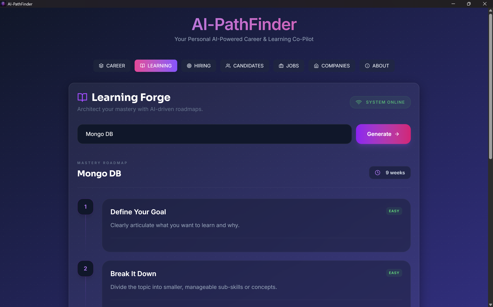
</p>

<p align="center">
  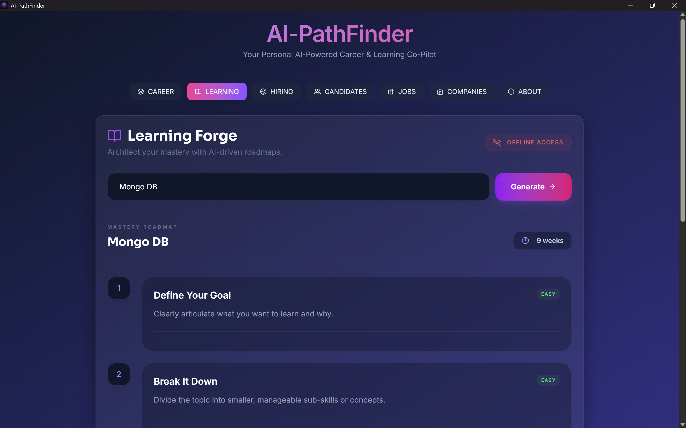
</p>

---

### 💼 3. Hiring Tab (Recruitment Hub)
* **Description**: Designed for recruiters and hiring managers. Paste a job description (e.g., *"Need a Python developer skilled in Django and APIs"*), and the engine runs a reverse scan against the local candidate pool, ranking applicants by skill alignment and providing 1-click outreach windows.
* **API Endpoints**: `POST /hiring`

<p align="center">
  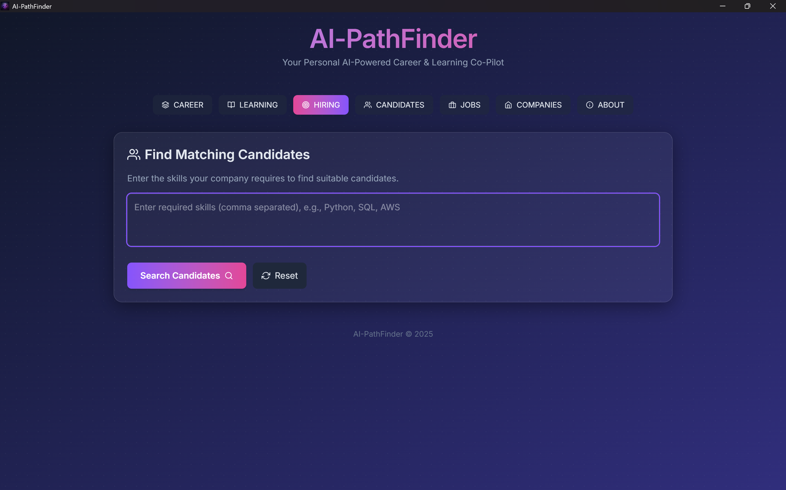
</p>

<p align="center">
  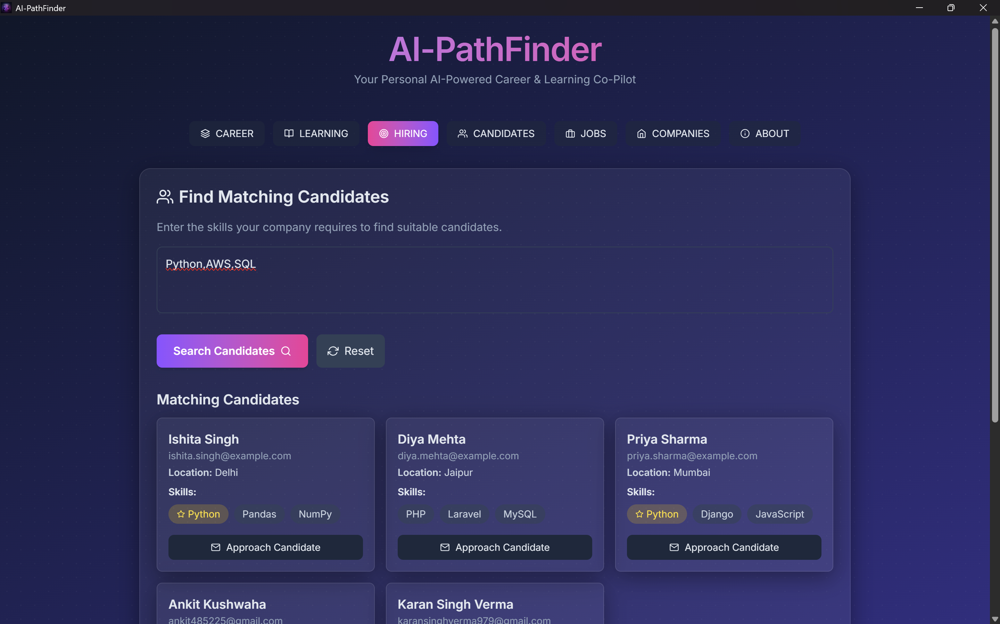
</p>

<p align="center">
  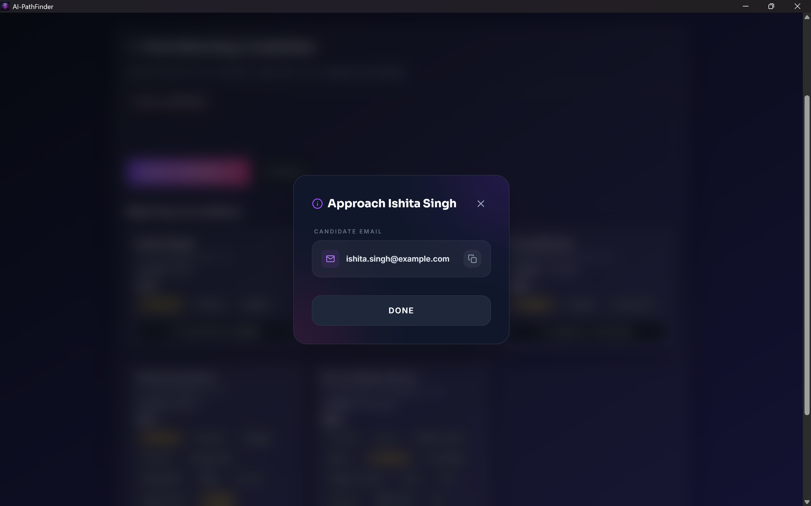
</p>

---

### 👥 4. Candidates Tab (Profile Manager)
* **Description**: Full CRUD management panel to inspect, register, update, and manage candidates in the local SQLite directory. Features randomized profile avatar generation via Dicebear API and protection locks on developer accounts.
* **API Endpoints**: `GET /candidates`, `POST /candidates`, `PUT /candidates/{id}`, `DELETE /candidates/{id}`

<p align="center">
  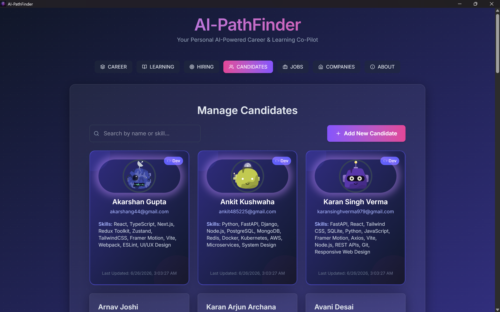
</p>

---

## 📦 Bundling & Standalone Compilation

To compile a standalone Windows installer from source:

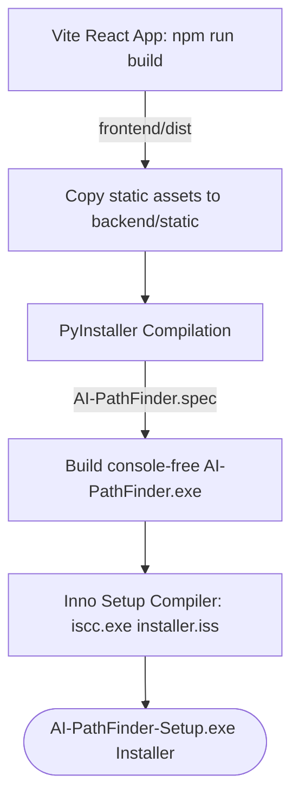
```mermaid
graph TD
    A["Vite React App: npm run build"] -->|frontend/dist| B["Copy static assets to backend/static"]
    B --> C["PyInstaller Compilation"]
    C -->|AI-PathFinder.spec| D["Build console-free AI-PathFinder.exe"]
    D --> E["Inno Setup Compiler: iscc.exe installer.iss"]
    E --> F(["AI-PathFinder-Setup.exe Installer"])
```

1. **Build Frontend Bundle**:
   ```bash
   cd frontend
   npm run build
   cd ..
   python -c "import shutil, os; shutil.rmtree('backend/static', ignore_errors=True); shutil.copytree('frontend/dist', 'backend/static')"
   ```

2. **Compile PyInstaller Executable**:
   ```bash
   cd backend
   pip install pyinstaller Pillow pywebview
   pyinstaller --onefile --noconsole --name "AI-PathFinder" --icon "icon.ico" --add-data "static;static" main.py
   cd ..
   ```

3. **Compile Inno Setup Installer**:
   ```bash
   iscc installer.iss
   ```
   *Generates `AI-PathFinder-Setup.exe` in the root directory.*

---

## 🧹 Setup Wizard & Deep Clean Uninstaller

* **Custom Database Directory Wizard**: The Inno Setup wizard (`installer.iss`) prompts the user to select an explicit database storage directory, defaulting cleanly to `%LOCALAPPDATA%\AI-PathFinder\Database\`. This decouples user state from program binaries.
* **Zero Cold-Boot Configuration**: If `candidates.db` is not found, `database.py` automatically initializes all SQLite schemas, activates foreign key constraints, and seeds default candidates and job postings.
* **Deep Clean Uninstaller**: Upon uninstallation, a custom Pascal routine queries the database destination, safely removes `candidates.db` and WAL journals, deletes user log directories, and purges all application shortcuts.

---

## 🔒 Security & Sovereign Runtime Standard

- **100% Local Sovereign Execution**: Zero candidate resumes, skills, or job descriptions are transmitted to cloud services. All matching algorithms run in memory on your workstation.
- **Dynamic Path Isolation**: Eliminates hardcoded user paths. Logs write to `%LOCALAPPDATA%\AI-PathFinder\Logs\`, and databases resolve through dynamic environment overrides or `config.json`.
- **OpenSSF Supply Chain CI**: GitHub Actions workflows enforce `permissions: contents: read` and pin dependencies to immutable 40-character commit SHAs.
- **Vulnerability Disclosure**: Managed through coordinated disclosure protocols in [SECURITY.md](SECURITY.md).

---

## 🤝 The Architects

* **[Karan Singh Verma](https://github.com/karansinghverma979)** — *Lead Full Stack Developer & Systems Architect*
* **Ankit Kushwaha** — *Backend Architect*
* **Akarshan Gupta** — *UI/UX Designer*

---

<div align="center">

<b>AI-PathFinder © 2025 · Released under the <a href="LICENSE">MIT License</a></b>

</div>
