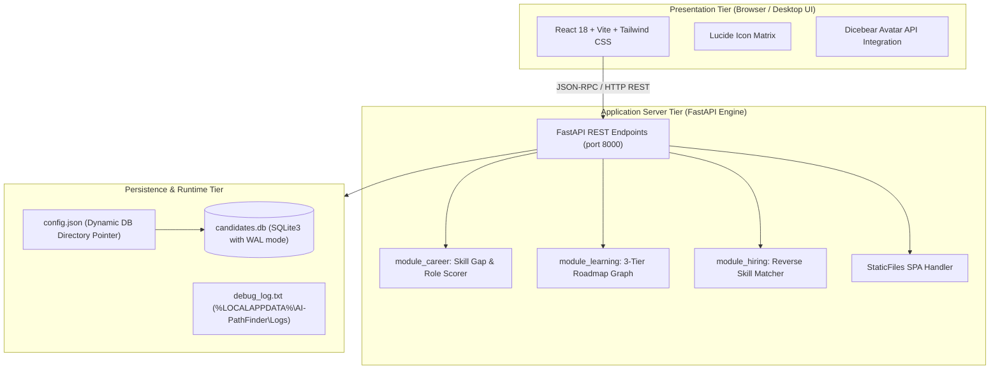

# 🏛️ AI-PathFinder System Architecture & Engineering Blueprint

> **Autonomous Career Navigator, Skill Gap Visualizer & Reverse-Hiring Recruitment Matrix**

---

## 1. Executive System Overview

AI-PathFinder is engineered as a **zero-dependency, standalone desktop application** for Windows 10 and 11. It bridges candidate skill self-assessment with corporate talent acquisition through a local, sovereign architecture:

```text
┌────────────────────────────────────────────────────────────────────────┐
│                   AI-PATHFINDER CO-PILOT ARCHITECTURE                  │
├───────────────────┬───────────────────┬────────────────────────────────┤
│    CAREER HUB     │   LEARNING FORGE  │          HIRING MATRIX         │
│  • Gap Analysis   │  • 3-Tier Paths   │  • Reverse Candidate Matcher   │
│  • Score Matching │  • React 19 / Py  │  • SQLite Talent Directory     │
│  • Missing Skills │  • Curated Guides │  • 1-Click Profile Outreach    │
├───────────────────┴───────────────────┴────────────────────────────────┤
│             STANDALONE INNO SETUP DESKTOP RUNTIME (WINDOWS)            │
│  FastAPI Backend (PyInstaller)  ◄──►  React 18 + Vite + Tailwind GUI   │
│  Custom DB Directory Wizard     ◄──►  Local SQLite (%LOCALAPPDATA%)    │
└────────────────────────────────────────────────────────────────────────┘
```

---

## 2. Multi-Tier Architectural Topology

The system adheres to a strict 3-tier separation of concerns:



---

## 3. Core Subsystems & Computational Logic

### 🎯 Subsystem A: Career Gap Analysis & Matching (`module_career.py`)
1. **Input**: User raw skills string (comma-separated or resume text).
2. **Extraction**: `extract_skills_from_text()` uses tokenization and regex matching against a curated vocabulary of 100+ technical skills.
3. **Scoring Function**:
   $$\text{Match Score} = \text{round}\left( \frac{|\text{Matched Skills}|}{|\text{Required Skills}|} \times 100 \right)$$
4. **Output**: Top 3 matching roles with exact intersections and missing skills list to provide actionable upskilling targets.

### 📚 Subsystem B: AI Learning Forge (`module_learning.py`)
* Pre-indexed, curated learning graphs for in-demand roles:
  * **Modern React 19**: React Compiler, Actions API, `useActionState`, Vite bundling.
  * **State & Data Fetching**: Zustand, TanStack Query (React Query).
  * **Fullstack React**: Next.js 15 App Router, Server Actions.
  * **Python & Backend**: FastAPI, Pydantic, SQLAlchemy, Docker.
  * **Data Science & AI**: Pandas, NumPy, Scikit-Learn, PyTorch.
* Every module provides 3 graded difficulty levels (*Easy*, *Medium*, *Hard*) with verified video links, documentation references, and official GitHub repositories.

### 💼 Subsystem C: Reverse-Hiring Recruitment Matrix (`module_hiring.py`)
* Allows companies and recruiters to paste job descriptions.
* Performs reverse token matching across all candidates registered in `candidates.db`.
* Ranks candidates by compatibility percentage and exposes 1-click email composition triggers.

### 👥 Subsystem D: Candidate & Company Directory (`database.py`)
* Backed by SQLite3 with foreign key enforcement (`PRAGMA foreign_keys = 1`).
* **Entity Relationships**:
  ```text
  COMPANIES (id, name, website, location, logo_url)
     │
     └──< JOBS (id, company_id, title, role, skills, experience, location)
  
  CANDIDATES (id, name, email, skills, location, is_developer, created_at, updated_at)
  ```
* **Auto-Provisioning**: On boot, if `candidates.db` is empty or missing, `check_and_seed_db()` creates all 3 tables and populates default developer profiles, companies, and vacancies in `<10ms`.

---

## 4. Inno Setup Packaging & Database Isolation

Standalone deployment on Windows utilizes Inno Setup 6 (`installer.iss`):

1. **Custom Pascal Folder Selector**:
   During installation, a custom wizard page prompts the user to select their desired database destination:
   * **Default Destination**: `%LOCALAPPDATA%\AI-PathFinder\Database\`
2. **Config Generation**:
   The installer creates a `config.json` inside `{app}`:
   ```json
   {
     "database_directory": "C:\\Users\\<user>\\AppData\\Local\\AI-PathFinder\\Database"
   }
   ```
3. **Runtime Decoupling**:
   `database.py` dynamically resolves the database path from:
   1. `DATABASE_PATH` environment variable override.
   2. `config.json` (`database_directory`).
   3. Executable directory fallback.
4. **Deep Clean Uninstaller**:
   On uninstall, custom Pascal routines read `config.json`, remove `candidates.db` and temporary WAL files, purge empty directories, and delete all Windows Start Menu and Desktop shortcuts.

---

## 5. Security & Portability Invariants

* **Zero Cloud Data Leakage**: All resumes, job requirements, and candidate records remain 100% on the local workstation.
* **Dynamic Path Expansion**: Zero hardcoded local machine paths in code or documentation. All directories expand through `LOCALAPPDATA` or `Path.home()`.
* **LF Normalization**: `.gitattributes` guarantees cross-platform line ending integrity.
* **OpenSSF CI/CD**: Pinned 40-character commit SHAs across all GitHub Actions workflows with least-privilege token permissions.
